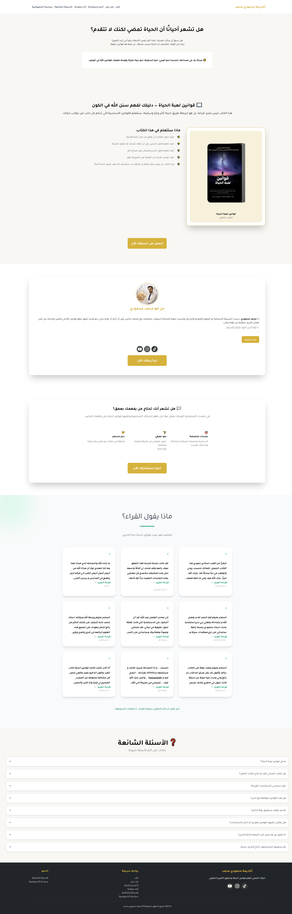
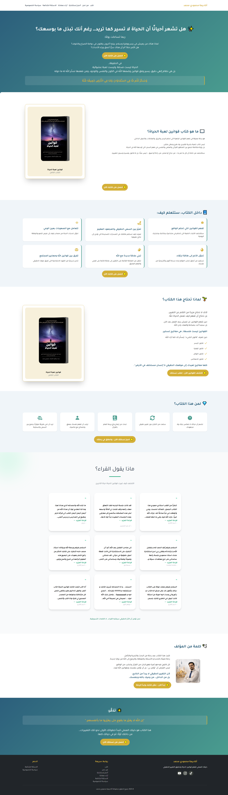

---

# Mahmoudi Mohammed Academy Production Case Study

Professional marketing website and sales funnel system developed for author and trainer Mohammed Mahmoudi to showcase books, consulting services, courses, and appointment booking experiences.

---

## 📑 Table of Contents

- [🚀 Project Overview](#-project-overview)
- [✨ Key Features](#-key-features)
- [🧠 Website Structure](#-website-structure)
- [🎨 UI/UX Direction](#-uiux-direction)
- [📱 Mobile-First Experience](#-mobile-first-experience)
- [🧳 Technologies](#-technologies)
- [📸 Screenshots](#-screenshots)
- [🌍 Live Website](#-live-website)
- [📌 Project Information](#-project-information)
- [📈 Project Impact](#-project-impact)
- [🔒 Source Code](#-source-code)
- [📬 Contact Information](#-contact-information)

---

## 🚀 Project Overview

Mahmoudi Mohammed Academy is a complete marketing website and funnel system developed for author and trainer Mohammed Mahmoudi.

The project was designed to present books, educational content, and consulting services in a highly professional and conversion-focused way while maintaining a smooth and elegant user experience.

The platform combines marketing psychology, clean UI/UX, responsive layouts, and conversion-oriented funnel structures to improve engagement, increase bookings, and strengthen brand authority.

The system also integrates appointment booking workflows, thank-you pages, tracking tools, and optimized call-to-action strategies.

---

## ✨ Key Features

- Professional marketing-oriented website structure
- Dedicated landing pages for books and offers
- Consultation booking system
- Integrated payment & conversion flow
- Mobile-first responsive design
- Elegant luxury-inspired UI design
- Conversion-focused CTA placement
- High-performance page loading
- TikTok Pixel integration
- Microsoft Clarity integration
- Thank-you pages after purchases and bookings
- Optimized visual hierarchy
- Trust-building content sections
- Smooth user navigation experience

---

## 🧠 Website Structure

### 🏠 Main Pages

- Home Page
- About the Author
- Consultation Booking
- Thank You Pages

### 📚 Book Pages

- Law of Intention
- Laws of the Game of Life

### 💼 Services

- Personal Consultation Booking
- Online Sessions
- Educational Content Presentation

### 📈 Funnel Flow

- Awareness Stage
- Trust Building
- Offer Presentation
- Booking & Conversion
- Thank You & Follow-up

---

## 🎨 UI/UX Direction

The interface was designed using an elegant earthy and gold-inspired visual style to create a premium educational and consulting brand experience.

The design strategy focused on:

- Clean visual hierarchy
- Strong CTA visibility
- Luxury-inspired UI
- High readability
- Mobile usability
- Smooth section transitions
- Marketing-focused layouts
- Trust-oriented content presentation

The website structure was optimized to guide visitors smoothly toward consultations, purchases, and engagement actions.

---

## 📱 Mobile-First Experience

The platform was primarily optimized for mobile users to ensure:

- Fast browsing experience
- Clear CTA interactions
- Responsive typography
- Smooth scrolling sections
- Better conversion behavior on smartphones

All layouts and sections were carefully adapted for responsive performance across devices.

---

## 🧳 Technologies

- Systeme.io
- HTML5
- CSS3
- JavaScript
- Tailwind CSS
- Payment Integration
- TikTok Pixel
- Microsoft Clarity

---

## 📸 Screenshots

### Homepage

### Book Landing Page

---

## 🌍 Live Website

https://www.mahmoudimohamed.com/

👉 View full case study on my website:  
https://mahmoudabuyoussef.com/projects/mahmoudi-mohammed-academy

---

## 📌 Project Information

| Field        | Details                                 |
| ------------ | --------------------------------------- |
| Project Type | Marketing Website & Funnel System       |
| Industry     | Education / Consulting / Personal Brand |
| Role         | Front-End Developer                     |
| Platform     | Systeme.io                              |
| Duration     | 1 Week                                  |
| Status       | Production                              |
| Year         | 2025                                    |

---

## 📈 Project Impact

- Improved personal brand authority and professionalism
- Increased consultation booking opportunities
- Enhanced conversion flow through optimized funnel structure
- Delivered responsive and smooth user experience
- Improved engagement with educational and promotional content
- Created scalable marketing infrastructure for future campaigns

---

## 🔒 Source Code

This project was developed for a real production environment.

The source code is private and not publicly available due to client and production restrictions.

This repository is intended for project presentation and case study purposes only.

---

## 📬 Contact Information

If you'd like to collaborate, discuss a project, or hire me for development work:

- 📧 Email: contact@mahmoudabuyoussef.com
- 💼 LinkedIn: https://www.linkedin.com/in/mahmoudabuyoussef
- 🌐 website: https://mahmoudabuyoussef.com
- 🐙 GitHub: https://github.com/mahmoud-abuyoussef
